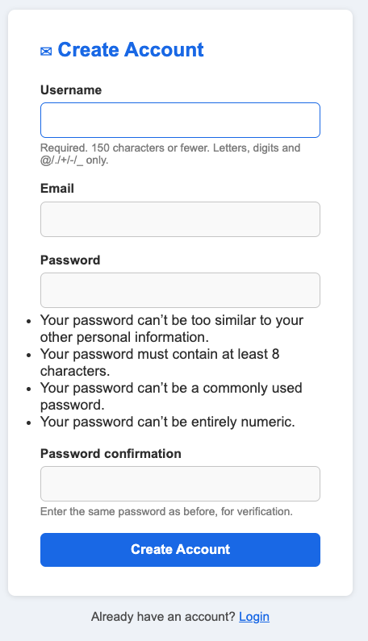
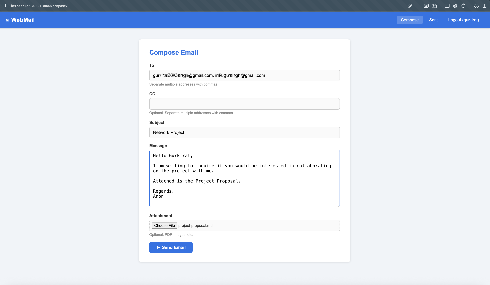
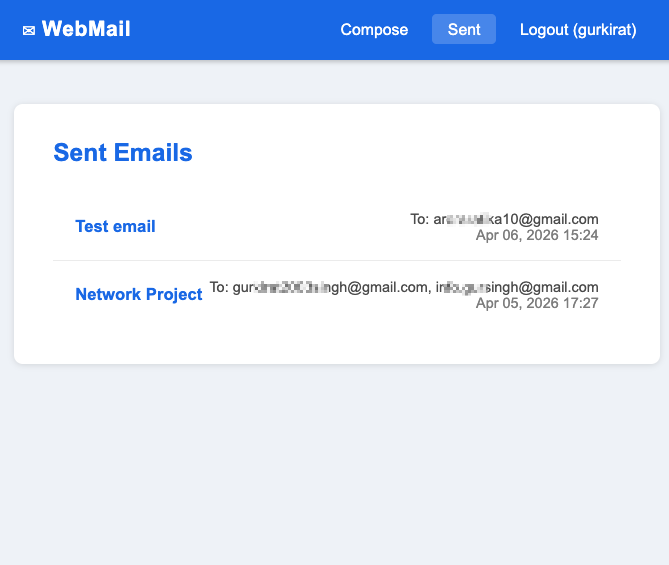
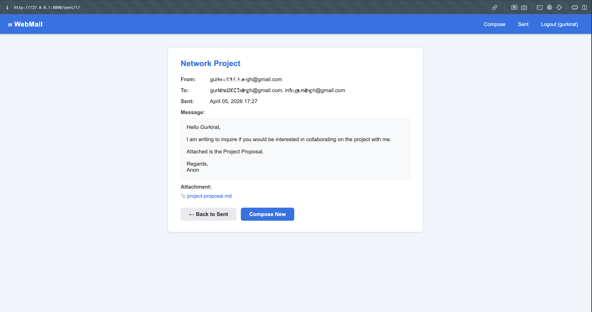

<style>
section {
  font-size: 22px;
}
table {
  font-size: 18px;
}
blockquote {
  font-size: 22px;
}
pre {
  font-size: 16px;
}
header {
  font-size: 14px;
  color: #999;
}
header strong {
  color: #2563eb;
}
section.title-slide {
  background: linear-gradient(135deg, #0f172a 0%, #1e293b 50%, #0f172a 100%);
}
section.part-design,
section.part-demo,
section.title-slide {
  --h1-color: #fff;
  --heading-strong-color: #fff;
  --fgColor-default: rgba(255, 255, 255, 0.95);
  --fgColor-muted: rgba(255, 255, 255, 0.7);
  color: white;
}
section.part-design {
  background: linear-gradient(135deg, #1e3a5f 0%, #2d5a8e 100%);
}
section.part-demo {
  background: linear-gradient(135deg, #064e3b 0%, #047857 100%);
}
.screenshot-placeholder {
  background: #f1f5f9;
  border: 2px dashed #94a3b8;
  border-radius: 8px;
  color: #64748b;
  text-align: center;
  padding: 40px 20px;
  font-size: 16px;
  margin-top: 12px;
}
</style>

<!-- _class: lead title-slide -->

# Web-Based Email Application

**Course:** Network Programming (CPAN-226-0NB)
**Institution:** Humber Polytechnic
**Presented by:** Gurkirat Singh & Ratika
**Date:** April 2026

---

<!-- _class: lead title-slide -->

# Agenda

### Part 1: Design & implementation

Problem, tech stack, architecture, SMTP flow, data model

### Part 2: Demo & evaluation

App walkthrough, limitations, conclusion & future work

---

<!-- _header: "" -->
<!-- _class: lead part-design -->

# Part 1: Design & implementation

**How the application was built and how it works**

---

<!-- header: "**Design & implementation** > Demo & evaluation" -->

# Problem statement

Most users interact with email through polished clients like Gmail or Outlook — without understanding what happens underneath

> This project bridges that gap by building a working email client from scratch using Python's standard library

**Learning objectives:**

- Understand SMTP and how a mail client talks to a mail server
- Implement MIME message construction with attachments
- Apply user authentication and session management
- Persist data with a relational database

---

<!-- header: "**Design & implementation** > Demo & evaluation" -->

# Tech stack

| Layer           | Technology                                        |
| --------------- | ------------------------------------------------- |
| Language        | Python 3.14                                       |
| Framework       | Django 6.0                                        |
| Email protocol  | SMTP over TLS (port 587)                          |
| Email libraries | `smtplib`, `email.mime` (stdlib — no third-party) |
| Database        | SQLite via Django ORM                             |
| Frontend        | HTML5, CSS3                                       |
| Auth            | `django.contrib.auth` (built-in)                  |
| Config          | `python-dotenv` for credentials                   |

> No external email libraries (e.g., `sendgrid`, `yagmail`) — all SMTP logic uses Python's stdlib to expose the protocol directly

---

<!-- header: "**Design & implementation** > Demo & evaluation" -->

# Application architecture

The app follows Django's **MVT (Model-View-Template)** pattern

```
project/
├── emailapp/        ← project config (settings, URLs, SMTP config)
└── mailer/          ← core app
    ├── models.py    ← SentEmail database model
    ├── views.py     ← login, register, compose, sent, detail
    ├── forms.py     ← ComposeForm, RegisterForm
    └── urls.py      ← 6 routes
```

**Request flow:**

1. Browser sends request → Django routes to a view
2. View processes form data, calls `smtplib` to send email
3. View saves result to SQLite via ORM
4. Template renders the response back to the browser

---

<!-- header: "**Design & implementation** > Demo & evaluation" -->

# SMTP email flow

Each outgoing email goes through these steps in `mailer/views.py`:

```python
# 1. Build MIME message
msg = MIMEMultipart()
msg['From'] = EMAIL_HOST_USER
msg['To'] = to_addr
msg['Subject'] = subject
msg.attach(MIMEText(body, 'plain'))

# 2. Attach file (if uploaded) — Base64 encoded
part = MIMEBase('application', 'octet-stream')
part.set_payload(attachment_file.read())
encoders.encode_base64(part)
msg.attach(part)

# 3. Connect, upgrade to TLS, authenticate, send
with smtplib.SMTP('smtp.gmail.com', 587) as server:
    server.ehlo()
    server.starttls()          # upgrade to TLS
    server.login(user, password)
    server.sendmail(user, recipients, msg.as_string())
```

---

<!-- header: "**Design & implementation** > Demo & evaluation" -->

# Data model

Every sent email is saved to SQLite for the logged-in user's history

```python
class SentEmail(models.Model):
    sender     = models.ForeignKey(User, on_delete=models.CASCADE)
    to         = models.TextField()
    cc         = models.TextField(blank=True)
    subject    = models.CharField(max_length=255)
    body       = models.TextField()
    attachment = models.FileField(upload_to='attachments/', blank=True)
    sent_at    = models.DateTimeField(auto_now_add=True)
```

- **`auth_user`** — Django's built-in table, passwords stored as PBKDF2-SHA256 hashes
- **`mailer_sentemail`** — one row per sent email, file stored at `media/attachments/`
- Credentials kept in `.env`, excluded from version control

---

<!-- _header: "" -->
<!-- _class: lead part-demo -->

# Part 2: Demo & evaluation

**App walkthrough, limitations, and what comes next**

---

<!-- header: "Design & implementation > **Demo & evaluation**" -->

# Register & login

**Register / Login**
New users sign up with a username, email, and password. Django enforces password strength and hashes credentials. Invalid logins show an error — valid ones redirect to Compose.



---

<!-- header: "Design & implementation > **Demo & evaluation**" -->

# Sending an email

**Compose** — To (multi-recipient), CC, Subject, Body, optional attachment. On success a green banner confirms delivery and the user lands in the Sent folder.



---

<!-- header: "Design & implementation > **Demo & evaluation**" -->

# Sent folder

**Sent folder** — lists all emails by the current user, most recent first. Clicking a row opens the full detail view with a file download link if an attachment was included.



---

<!-- header: "Design & implementation > **Demo & evaluation**" -->

# Example Email



---

<!-- header: "Design & implementation > **Demo & evaluation**" -->

# Limitations

- **Send-only** — no inbox; receiving email (IMAP/POP3) is not implemented
- **Shared sender identity** — all mail goes out from one configured Gmail account, not per-user addresses
- **Gmail-specific** — SMTP settings hardcoded for `smtp.gmail.com`; other providers need manual changes
- **Plain text only** — no HTML email body support
- **Development server** — not production-ready; needs Gunicorn + Nginx for real deployment
- **No search or pagination** — sent folder loads all records at once

---

<!-- header: "Design & implementation > **Demo & evaluation**" -->

# Conclusion & future improvements

**What was achieved:**

- Functional web email client built with Python stdlib — no email abstraction libraries
- Direct exposure to SMTP handshake, MIME structure, and TLS
- User auth, file attachments, and database persistence all working end-to-end

**Future improvements:**

| Improvement            | Technology                          |
| ---------------------- | ----------------------------------- |
| Inbox (receive emails) | `imaplib` — IMAP protocol           |
| Per-user sending       | Gmail OAuth 2.0                     |
| HTML email body        | TinyMCE rich-text editor            |
| Multi-provider support | Configurable SMTP settings          |
| Production deployment  | Docker, Gunicorn, Nginx, PostgreSQL |
| Email scheduling       | Celery + Redis task queue           |

---

<!-- header: "Design & implementation > **Demo & evaluation**" -->

# References

1. J. Klensin, "Simple Mail Transfer Protocol," **RFC 5321**, IETF, 2008
2. N. Freed & N. Borenstein, "MIME Part One," **RFC 2045**, IETF, 1996
3. Python Software Foundation, **`smtplib`** documentation, Python 3.14
4. Python Software Foundation, **`email.mime`** documentation, Python 3.14
5. Django Software Foundation, **Django 6.0** documentation
6. Google LLC, "Send email with Gmail SMTP," Google Workspace Admin Help
7. J. Postel, "Simple Mail Transfer Protocol," **RFC 821**, IETF, 1982
8. P. Resnick (Ed.), "Internet Message Format," **RFC 5322**, IETF, 2008
